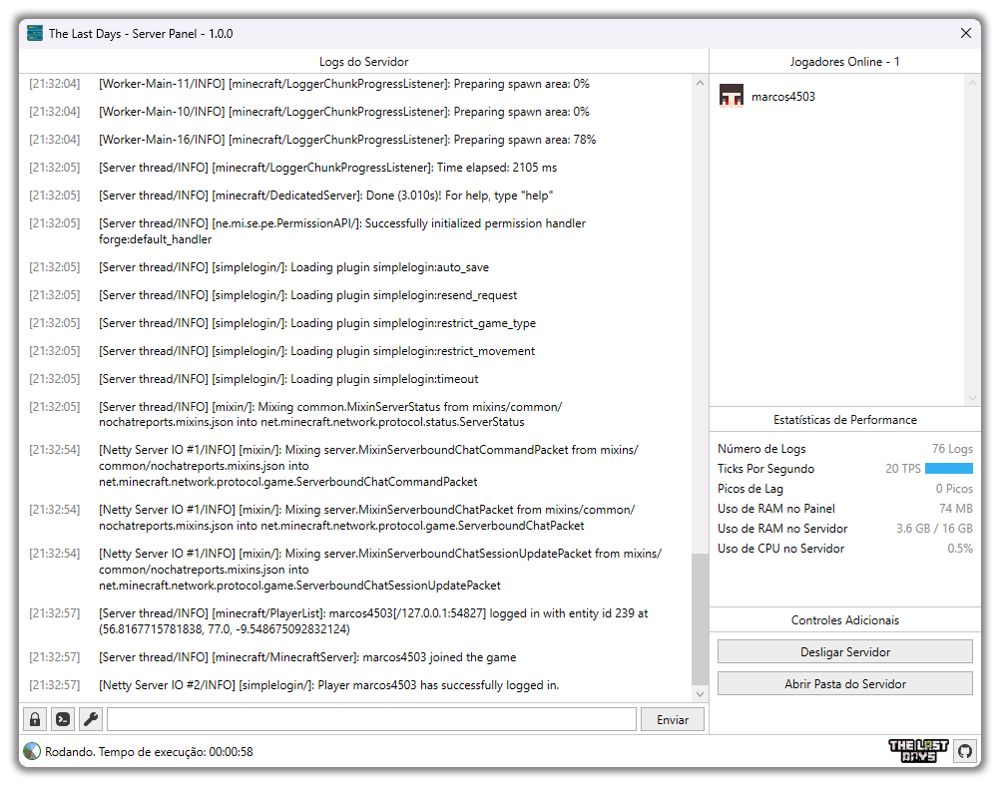

    
      
    Go to "Releases" page, and find the "1.0.0" version, in "Assets" section, download the file "The_Last_Days_Server_Panel.exe". Read all the instructions below and then just enjoy! 

# About this Software

The Last Days Server Panel is the perfect all-in-one server manager/panel for the Modpack created by me, The Last Days Modpack. In this Modpack, you need to live in a post-apocalyptic world, infested by Zombies and Mutant Creatures. You need to survive, search, steal, kill, build, arm yourself, ally, research, hide, and much, much, much more. The Modpack is basically a mix of Minecraft with RPG elements and survival games like DayZ and Project Zomboid.

Thanks to The Last Days Server Panel, you can easily run a The Last Days Modpack server on your machine. When you open the Panel, it will attempt to search for server files on your computer. If it doesn't find it, it will ask you if you want to download these files, and if you allow it, then it will download all files 100% automatically, without you having to do anything. If there are updates to the Server files, it will let you know. Once the server files are ready, the Panel will switch to the standard interface and allow you to start or stop the server, view real-time performance statistics, server execution details, view logs, send commands, access the server history, commands, access useful commands, and more!

If you want to play The Last Days Modpack, you will need the Modpack Client. You can <a href="https://github.com/marcos4503/the-last-days-launcher" target="_blank">get it here</a>!

